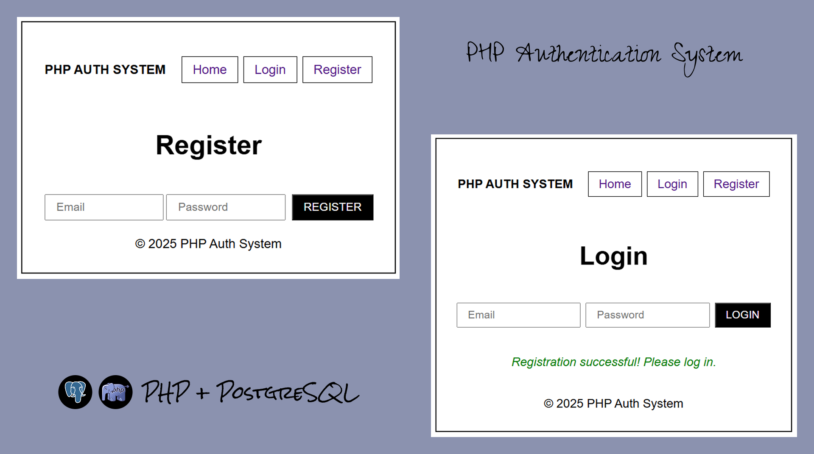

# PHP__001__AuthenticationSystem

## Project Overview
- **name**: AuthenticationSystem
- **type**: Web app
- **Live**: [❌]

## Preview



## Description 

- This project implements core authentication logic for user registration, login, and logout — all built using PHP for both frontend and backend, with PostgreSQL as the database solution.
- The architecture is simple yet functional, with clearly defined routes and database interactions. It’s designed as a full PHP stack application, demonstrating how to manage sessions, database communication, and form submissions without external frontend frameworks.

## Benefits

- The application emphasizes user experience (UX) by clearly guiding the user through each step and providing real-time visual feedback via flash messages.
- The redirection and session logic ensure a seamless flow through the authentication process.

## Focus

- The design is intentionally minimalistic to keep the spotlight on the core authentication functionality. 
- It prioritizes logic, structure, and security over visual presentation.

## Tools & Techniques Used

- **Composer**

    Used to manage PHP dependencies:
    - vlucas/phpdotenv – for loading environment variables from a .env file.
    - PHPMailer – for sending verification emails to users.

- **PHP** 

    Handles routing, database interaction (with PostgreSQL), form processing, and view rendering. A .sql file is used to define the database schema, reducing the need for manual table creation.

- **Mailtrap**

    Used to simulate email delivery during development, specifically for account verification links.

- **$_SESSION**

    Used to store user data in the browser, enabling persistent login status using cookies.

- **password_hash()**

    Hashes user passwords before storing them in the database to ensure they are not saved in plain text. This adds an essential layer of security.

- **bin2hex()**

    Used to convert binary data (e.g., randomly generated tokens) into a hexadecimal format, suitable for URLs or storage.

- **session_regenereate_id()**

    Regenerates the session ID to prevent session fixation attacks. It’s typically called after login for improved security.

- **session_start()**

    Initializes the session. A helper function checks whether session_status() === PHP_SESSION_NONE before calling it, ensuring sessions aren’t accidentally started multiple times.

- **Routing**

    The application uses a simple custom routing system written in plain PHP. It parses the current request URI, compares it to a predefined list of routes, and loads the appropriate PHP file based on the match.

    If the route exists in the defined list, the corresponding file is included and executed; otherwise, a 404 error page is returned.

- **ob_start()** & **ob_get_clean()** + **Layout**

    Used to implement a basic layout system. Views are buffered using ob_start() and captured using ob_get_clean(), allowing for a master layout where content can be dynamically injected.

- **SQL File**

    Defines the user table schema, including fields like: id, username, email, password, verification_token, is_verified and created_at. This ensures consistent structure and eliminates the need for manual setup in the PostgreSQL database.

- **Views**

    The project uses plain HTML views. Flash messages (e.g., success or error messages) are displayed by checking session variables and rendering the message conditionally in the frontend.

- **```<form>``` Elements**

    Used to send data from the client (e.g., login credentials or registration info) to the server via POST requests. All forms are secured and validated before interacting with the database.

## Working locally

To run this project locally, follow these steps:

1. **Clone the repository**

   ```bash
   git clone https://github.com/MiloosN5/PHP__001__AuthenticationSystem.git
   cd PHP__001__AuthenticationSystem
   ```

2. **Make sure you have PHP installed on your system**

   You can check this by running:
    ```bash
    php -v
    ```

4. **Start the local PHP development server:**

    ```bash 
    php -S localhost:8000 -t public
    ```

5. **Open your browser and visit:**

    ```bash
    http://localhost:8000
    ```

    ⚠️ Note about **Port**

    If port 8000 is already in use, you can use another available port, for example
    
    ```bash
    php -S localhost:8080 -t public
    http://localhost:8080
    ```

    ⚠️ Note about **PHP version**

     This project was built using **PHP 8.4.3**

    ⚠️ Note about **PostgreSQL** + **Mailtrap**

    The project includes a .env.example file that serves as a template for your environment variables. To get started, duplicate this file and rename it to .env, then fill in your own credentials:
    - PostgreSQL connection details (e.g. host, database name, username, password)
    - Mailtrap settings (used for sending verification emails)

## Useful links
- [PHP](https://www.php.net/downloads.php)
- [Mailtrap](https://mailtrap.io/)
- [phpdotenv (by Vlucas)](https://github.com/vlucas/phpdotenv)
  - license: [BSD-3-Clause license](https://github.com/vlucas/phpdotenv?tab=BSD-3-Clause-1-ov-file#readme)
